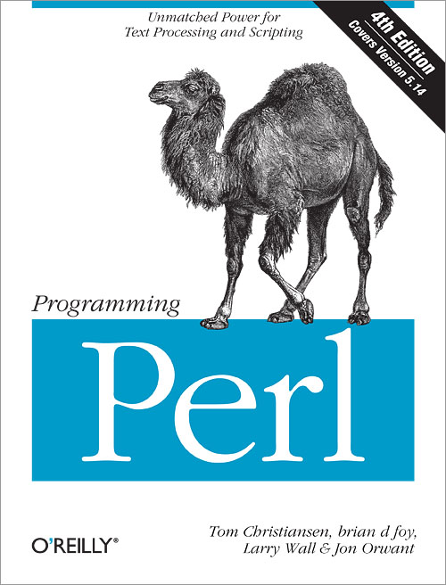

!SLIDE
# Auto-generated Docs

!SLIDE center

!SLIDE bullets incremental
# The Three Great Virtues of a Programmer
* Laziness
* Impatience
* Hubris

!SLIDE center

!SLIDE center

!SLIDE
## Javadoc: a good tool gone bad

!SLIDE
"Laziness: The quality that makes you go to great effort to reduce overall
energy expenditure. It makes you write labor-saving programs that other people
will find useful and document what you wrote so you don't have to answer so
many questions about it."

!SLIDE
## Computers suck.

!SLIDE
## Computers suck at writing docs for humans to read.

