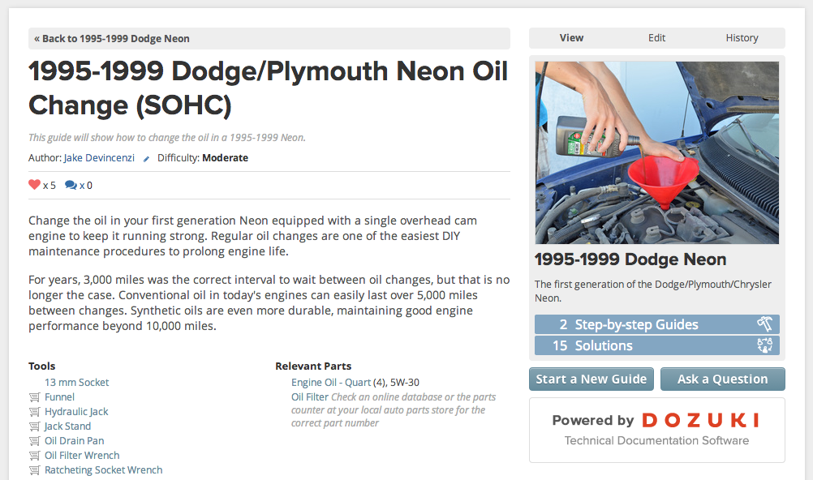
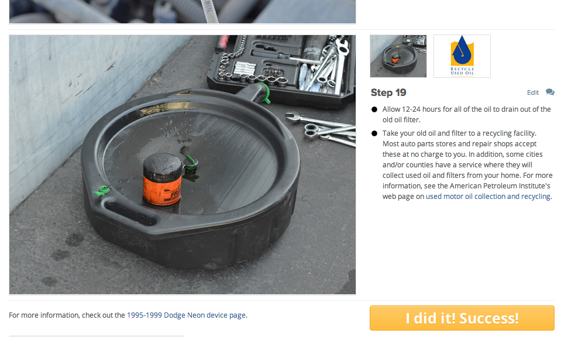
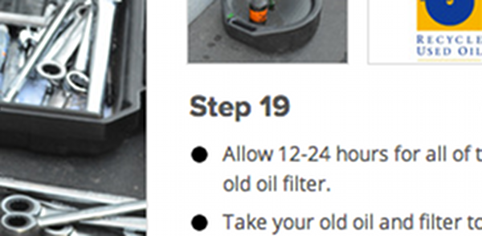
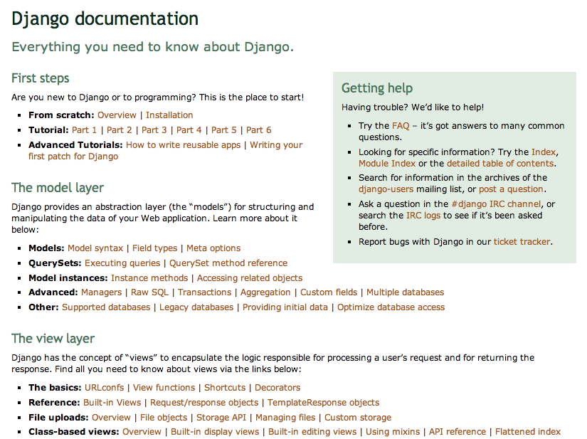

!SLIDE
# Overly-Verbose Instructions

!SLIDE center

!SLIDE center

!SLIDE center

!SLIDE
## Omit <strike>needless</strike> words.

!SLIDE
## Know your audience.

!SLIDE center

!SLIDE
-v      Verbose mode.  Multiple -v options increase the verbosity.  The maximum is 3.

ssh(1)

