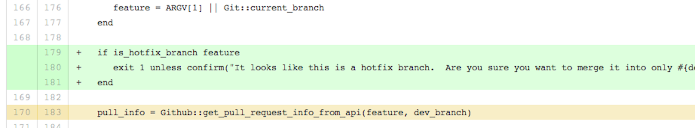

!SLIDE
# Poka-yoke
## "Mistake-proofing"

!SLIDE bullets incremental
* Humans will always make mistakes,
* but mistakes don't have to become defects.

!SLIDE bullets
* http://www.mistakeproofing.com/example1.html
* http://pokayoke.wikispaces.com/

!SLIDE
## feature merge?  hotfix merge?

!SLIDE center

